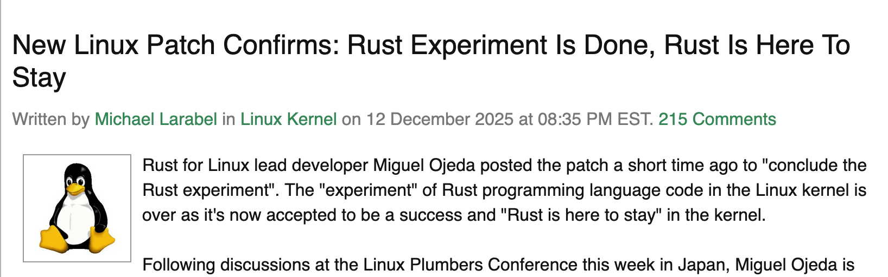
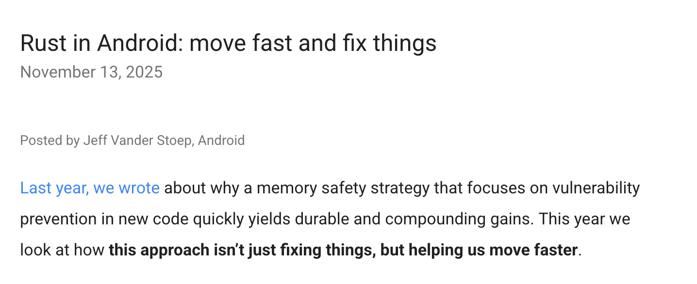
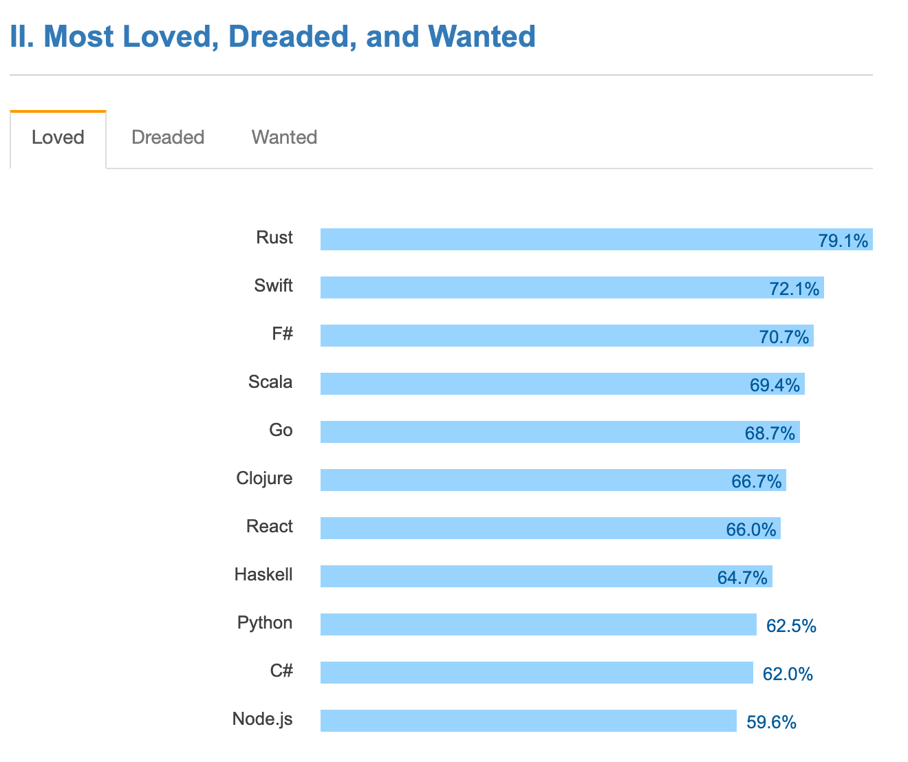
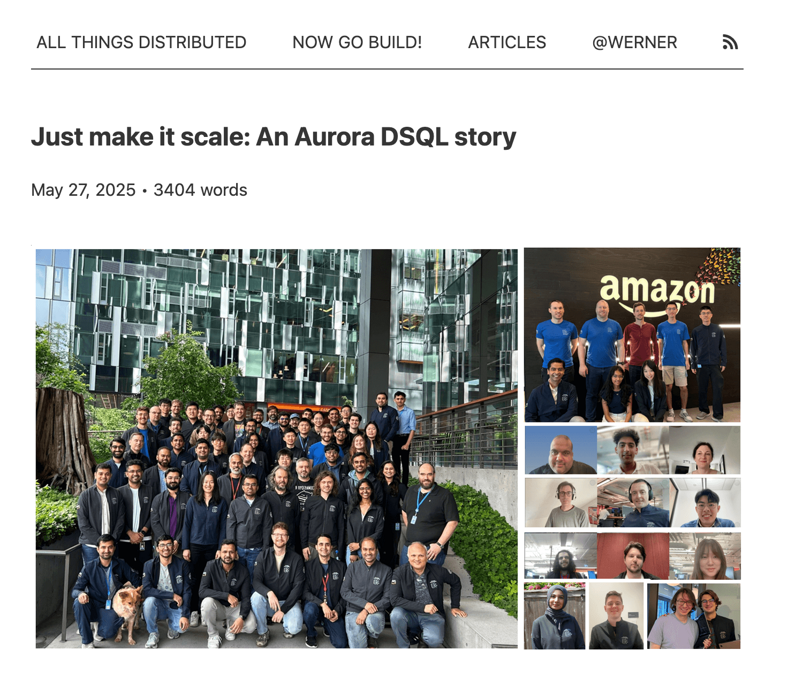
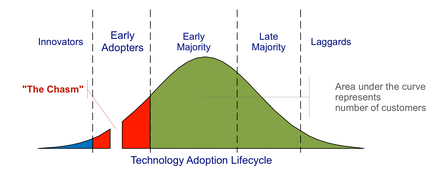
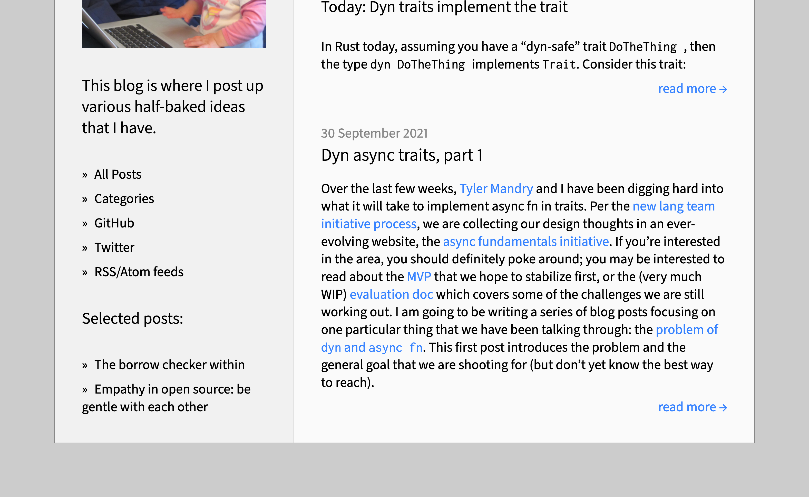
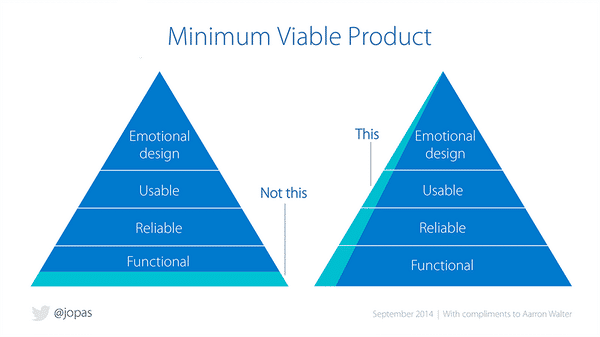
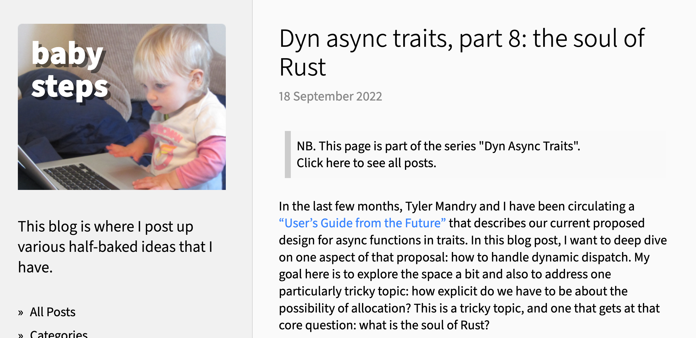
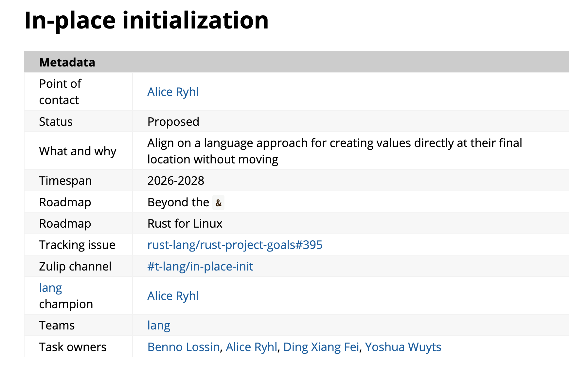

class: center
name: title
count: false

# Rust's big moment

.p60[]

## If...we don't screw up.

.me[.grey[*by* **Nicholas Matsakis**]]
.left[.citation[View sl ides at `https://nikomatsakis.github.io/rusts-big-moment-2026/`]]

---

# Who am I?

--

Longest serving Rust maintainer -- since 2011

--

Co-lead of the Rust language design team

--

The borrow checker is my fault (sorry not sorry)

--

Senior Principal Engineer at Amazon

---

# Rust is flying high right now

.center[.p60[]]


???

From that vantage point at Amazon, I can tell you, Rust is soaring high right now.

I mean, just take a look at the platinum members of the Rust Foundation.

---

# Rust powers the cloud, big services

.center[.p80[]]

--


.arrow.abspos.top230.left290.rotate320[]

.arrow.abspos.top340.left290.rotate320[]

.arrow.abspos.top340.left430.rotate320[]

???

To start, here are the platinum members of the Rust foundation.

You see a lot of household names. 

Right from this you can see that Rust is taking a bigger and bigger role in powering the cloud.

At AWS, Rust is being used everywhere from S3 to EC2.

Microsoft is using Rust in Azure and in their kernel-- there was a great talk by Marc Russinovich at RustConf last year about it.

From what I hear, Meta is moving more and more of their core services to Rust.

---

# Rust is used in Linux

.center[.p80[]]

--

.arrow.abspos.top500.left340.rotate320[]

--

.abspos.top250.left80.rotate40.p80.bordered[]


--

.abspos.top200.left80.rotate340.p80.bordered[]


---

# Rust is used in Android Mobile

.center[.p80[]]

--

.arrow.abspos.top230.left420.rotate320[]

--

.abspos.top180.left120.p80.bordered[]


???
---

# It wasn't always this way

.center[]

???

Rust made 1.0 in 2015. Our future was a lot less clear back then.

We had exactly one big-time production user then, Dropbox.

We had a lot of ambition, but there was so much to do. We had no IDE support. We had a fairly steep learning curve. A minimal standard library.

Go and Swift had been announced just a few years before, and each of them had backing by a big corporation, so it felt like "damn are we going to be able to pull this off?"

---

# It wasn't always this way

.center[.p60[]]

.center[<audio controls src="./images/you-know-what-i-think.mp3"></audio>]

???

All of this reminds me of a scene from My Cousin Vinny. Remember I told you that Vinny is a lawyer trying to save his cousin from false charges of murder.

There's a point where he realizes what he's up against. It's his first trial and it's the big leagues: if he screws up, his cousin is going to get the death penalty.

At this moment, his girlfriend Mona gives him a pep talk. Here, listen.

---

# StackOverflow survey from 2016

.center[.p60[]]

(The year before, [we were number 3](https://survey.stackoverflow.co/2015#tech-super))

???

For us, that survey was the StackOverflow survey in 2016. That year, and every year since then, Rust has toped the "most loved" category, meaning the percentage of developers using the language who want to keep using it.

You gotta understand what that means: there could be 3 people using something, but if all 3 want to keep using it, you get to 100%. So it doesn't mean you're a success.

But it does mean you've got something that people like.

---

# They come for performance...

* No GC = tight tail latency, low memory usage
* No mandatory runtime = embedded, kernel
* No undefined behavior = fewer vulnerabilities, fearless concurrency

???

And what is that something? You might think it's the usual things, fast performance or whatever. From my experience, though, that's not it.

Don't get me wrong, those things are important.

Not having a GC is what lets us get tight tail latency and low memory usage. That's why clouds are adopting Rust.

Not having a runtime is what lets us integrate into the Kernel, which is why Linux and Android are interested.

Not having UB is what lets us get really fast, really secure CLI utilities, which is why Canonical and Ubuntu are interested.

So yeah, these things are necessary. But they aren't what people love.

---

# ...they stay for reliability and versatility

> People think that Rust is all about performance. But what people love most about Rust is enums.<br>
> <br>
> &mdash; Carl Lerche

???

Actually, Carl Lerche, author of Tokio, nailed it a long time ago. He told me that what people really love about Rust is the enums. And I can attest to that. Enums-- specifically enums-- are great. But they're also just part of a larger design geared for reliability and versatility.

---

# ...they stay for reliability and versatility

> When I got to know about it, I was like: *Yeah, this is the language I've been looking for. This is the language that will just make me stop thinking about using C and Python.* **I just have to use Rust because then I can go as low as possible as high as possible.**<br>
> <br>
> &mdash; Software engineer and community organizer in Africa

???

I hear from a lot of folks who started using Rust on the *hardest part* of their system. At first they think "well, the learning curve is a pain, but it's worth it for this low-level system". But once the're past the learning curve, they find Rust is actually pretty nice. They start to use it in more and more places -- and before you know it, it's a Rust shop.

---

# Aurora DSQL makes the point

.center[.p60[[](https://www.allthingsdistributed.com/2025/05/just-make-it-scale-an-aurora-dsql-story.html)]]

.footnote[
    [Link to blog post](https://www.allthingsdistributed.com/2025/05/just-make-it-scale-an-aurora-dsql-story.html)
]

???

We see this in a lot of places. One really nice version of it came out of AWS.

Aurora DSQL is one of our newly launched services. It's written 100% in Rust, but what's interesting is that it wasn't always this way.
If you read the post, you'll see that they started building just the data plane, with the control plane in Kotlin and the Postgres extensions in C.
But eventually they rewrote it to be top-to-bottom in Rust -- and that includes the internal ops web page.

I took two lessons from this. First, that the fundamentals of Rust are solid. We are delivering a great platform for building foundational software.

But also that *foundational* software is not enough. We need to aim to be usable for the full spectrum of applications.

---

# "The Rust promise"

## It takes time to learn Rust...

> I actually did not understand the borrow checker until I spent a lot of time writing Rust.

???

The pitch for Rust has traditionally been a bit of a tricky one. It's what I like to call an "eat your vegetables" pitch. It starts by saying, yes, it's going to take time to learn Rust. You have to put in the effort.

---

## ...but it will help you level up

> Rust is one of those languages that has just got your back. You will have a lot more sleep and you actually have to be less clever.<br>
> <br>
> &mdash; Rust consultant and open source framework developer

???

But it's worth it, because you're able to get a lot more done.

---

## ...and it will keep you and your team in sync

> Rust just lowers that bar. It's a lot easier to write correct Rust code. As a leader on the team, **I feel a lot safer when we have less experienced engineers contributing to these critical applications.**<br>
> <br>
> &mdash; Distinguished engineer working on cloud infrastructure services

???

When you're on a team, the calculus is a bit different, but it's the same basic pitch. Instead of it being about you investing the time to learn, it's about that you'll take a bit longer to onboard new members who don't already know Rust. But you'll be able to give them harder tasks because they'll make fewer mistakes.

Regardless, an eat your vegetables pitch is always a tough sell, people like to get results fast, but in Rust's case, the payoff is real -- and that's why we have been seeing slow, steady growth.

The thing is, all of that is about to change.

---

# Agents are changing the game

???

Unless you've been under a rock, and even if you have been, you've probably heard a bit about AI. You've probably heard a LOT, and a lot of it is nonsense.

On the one hand, you have people telling us that coding is dead as a profession. And on the other, people say AI is useless, all hype.

Both are quite wrong. The truth is that agentic development is young. It makes a lot of mistakes and people are adding LLMs into all kinds of silly places.

But at the same time, it's a game changer. It can do tasks I never thought I would see a computer perform. And it has already changed the way a lot of people write code.

---

# LLMs turn our expectations upside down

|                                 | Human | Computer |
|---------------------------------|-------|----------|
| Tedious detail, calculations    | ❌     | ✅        |
| Ambiguous problems              | ✅     | ❌        |
| Big picture, strategic thinking | ✅     | ❌        |

???

Part of the weirdness about LLMs is that they turn our expectations upside down.

We're used to this world, where computers are great at calculations, but the only way they can handle ambiguity is to search all possibilities.

---

# LLMs turn our expectations upside down

|                                 | Human | Computer | LLM |
|---------------------------------|-------|----------|-----|
| Tedious detail, calculations    | ❌     | ✅        | ❌   |
| Ambiguous problems              | ✅     | ❌        | ✅   |
| Big picture, strategic thinking | ✅     | ❌        | ❌   |

???

LLMs are different. They actually stink at calculations. Don't ask your LLM to add numbers. But they are natives with probability, and they can attack ambiguous problems with a lot of success.

In some sense, what we asked for was a smarter computer. What we got was more like an inexperienced human. Just like an intern, say, or a new hire, LLMs don't have a lot of context -- pun intended. But they can still be very effective.

---

# Remember this?

> Rust just lowers that bar. It's a lot easier to write correct Rust code. As a leader on the team, **I feel a lot safer when we have less experienced engineers contributing to these critical applications.**<br>
> <br>
> &mdash; Distinguished engineer working on cloud infrastructure services

???

---

# Remember this?

> Rust just lowers that bar. It's a lot easier to write correct Rust code. As a leader on the team, **I feel a lot safer when we have ~~less experienced engineers~~ contributing to these critical applications.**<br>
> <br>
> &mdash; Distinguished engineer working on cloud infrastructure services

--

.abspos.top250.left350.p100.bordered.big.red[coding agents]

--

.abspos.top180.left120.p100.rotate345.bordered[]

???

Remember this quote? I was arguing that, yeah, Rust took time to learn, but once you learned it, you could move faster. The reason was that the compiler gave you *guardrails* -- it caught mistakes early and helped you to learn.

All of those arguments apply equally well, better really, to agents. And this is part of why you are seeing a lot of people adopt Rust.

And why you have the CEO of OpenAI tweeting about it.

---

# AI is coming

.center[.p80[]]

???

OK, you can all breath a sigh of relief. I'm not here to advocate for AI. I'm just telling you the facts I see in terms of what's happening in the industry.

---

# Rust's big moment

.center[.p60[]]

.center[<audio controls src="./images/you-know-what-i-think.mp3"></audio>]

.center[<audio controls src="./images/if-you-don't-fuck-up-bg0.mp3"></audio>]

???

And this brings us back full circle.

You remember when Marisa Tomei was telling Vinny how he was gonna be really great, once he got out there?

Well I'm telling you, we are doing really great. Foundational software across the cloud, the desktop, and mobile are moving onto Rust more and more. And the biggest challenge for Rust, its learning curve, is becoming less relevant. So things are looking good, right?

Yes, they are -- but, well, let me play what comes next in the movie. And there it is.
---

# If we don't screw up?

--



.footnote[
    Image from Wikipedia
]

???

What do I mean by if we don't screw up? Well, here's the thing.

I perceive Rust to be at a phase change moment. Have you ever heard the term crossing the chasm? It marks the moment that a technology goes from "early adopters" into the mass market. It's not a precise thing, and I think Rust has been "mid-cross" for a long time -- but my take is that agentic coding is pushing into the early majority faster than ever.

That's great, but it's putting more pressure on some persistent challenges that have dogged us for a long time. And I think addressing those challenges is going to mean some of the "common wisdom" that we have in Rust-land needs to be amended, do things a bit differently than we've done them in the best.

The good news though is that if we do, if we meet the moment, we can both make Rust the programming language and Rust the open-source community more inclusive and more supportive than ever. So let's talk about it.

---

# Challenges ahead

* Async experience
* Using the right crates... and only the right crates
* Funding maintenance across the Rust universe

.footnote[
    A non-exhaustive list, duh.
]

???


So what are those challenges? Well, there are many, but here's the 3 that I want to talk about today.

---

# Challenges ahead

* **Async experience**
* Using the right crates... and only the right crates
* Funding maintenance across the Rust universe

---

# Async is critical to Rust

* Wide range of uses and requirements
    * At-scale data planes
    * CRUD-like control planes
    * "FAAS" like Lambda, Azure Functions
    * Kernels
    * Mobile, actor-like architectures
    * Embedded networking (no operating system)
    * ...and more

???

Async Rust has become really important to Rust. Part of why it is so important is that it spans a ton of applications.

---

# Async is critical to Rust

* Wide range of uses and requirements
    * **At-scale data planes**
    * **CRUD-like control planes**
    * **"FAAS" like Lambda, Azure Functions**
    * Kernels
    * Mobile, actor-like architectures
    * Embedded networking (no operating system)
    * ...and more

???

On the one side, you have "big iron" server applications, which handle requests. These vary from at-scale data planes that process tons of messages per second down to control plans and such that trigger every once in a while.

---

# Async is critical to Rust

* Wide range of uses and requirements
    * At-scale data planes
    * CRUD-like control planes
    * "FAAS" like Lambda, Azure Functions
    * Mobile, actor-like architectures
    * **Kernels**
    * **Embedded networking (no operating system)**
    * ...and more

???

At the other extreme, you have things like kernels and embedded sensor nodes or what have you, where you need to do networking or communication but you may not even have an operating service to build on.

---

# Bring your own runtime

???

This flexibility explains why Rust's async feature is designed the way it is. Unlike Java or Go or Swift, which ship a relatively complete standard library, Rust's async support is bare bones. Instead, we lean on the ecosystem. That way you can have crates like tokio that cater to the server use case and crates like embassy that cater to the bare metal, embedded needs. And Rust's async-functions have to work for both.

---

# Async's got some seriously sharp edges

> When you got Rust that's both async and generic and has lifetimes, then those types become so complicated that **you basically have to be some sort of Rust god in order to even understand this code** or be able to do it.<br>
> <br>
> &mdash; Software engineer with production Rust experience

???

The thing is, async Rust is popular, but it's also, let's face it, kinda hard. This is one of my favorite quotes that came out of these interviews we did last year, where the guy says you "basically have to be some sort of Rust god" to figure out some of the async code. It makes me laugh every time. Kinda true.

---

# You know what I'm talking about

* "Cancellation safety"
* "My `Drop` needs to use `await`"
* "How can I figure out which task is deadlocking?"
* "Why do I have these occasional spikes in latency?"

???

I suspect any of you who've done async Rust hacking know what I'm talking about. Async Rust is in *that state*, a state I know well -- the state where, once you learn how things work, you can be really effective, but learning how things work is pretty hard. There's just a lot of little tips and tricks you have to know.

Now, you *might* think that agents help with this. And they do, a bit. They know a lot of those tips and tricks. But I've also found that they actually don't do much better. They make a lot of those same mistakes that humans make -- or, even worse, sometimes they port over patterns from other languages that don't fit Rust very well. And even when they can figure it out, they burn tokens debugging complex type errors.

---

# "Just add async"

???

So what do we want? I think the goal is actually fairly easy to say. We want async Rust to feel like a simple superset of "regular Rust". You want to be able to just write the Rust you're used to but add an "async" here and an "await" there and have things basically work. Then you want to layer on the new cool superpowers.

Unfortunately, that's not how it works.

---

# Where might you want to use async?

| Feature                                     | Status |
|---------------------------------------------|--------|
| Inherent and top-level functions            | 2018   |
| Crate-local trait methods (static dispatch) | 2023   |
| Trait methods (dynamic dispatch)            | ...    |
| Core interop and ecosystem traits           | ...    |
| Drop                                        | ...    |
| Iterators and similar patterns              | ...    |
| Streams                                     | ...    |

???

The problem is that right now you can only use async-await in a few contexts, but there are a lot of places that you might need them. And progress 

Right now, we support inherent functions and a rather limited subset of traits. 

---

# What makes async great is what makes async hard

* **Wide range of uses and requirements**
    * At-scale data planes
    * CRUD-like control planes
    * "FAAS" like Lambda, Azure Functions
    * Mobile, actor-like architectures
    * Kernels
    * Embedded networking (no operating system)
    * ...and more

???

---

# Example: async fn in trait

```rust
trait MessageProcessor {
    async fn process(&self, message: Message);
}

impl MessageProcessor for Processor1 {
    async fn process(&self, message: Message) { ... }
}

impl MessageProcessor for Processor2 {
    async fn process(&self, message: Message) { ... }
}
```

---

# When you call statically

```rust
fn foo<P: MessageProcessor>(processor: &P) {
    let future = processor.process(Message::new());
    //  ------ The type of this will depend on `P`.
    //         But for a given `P`, it's always the same.
}
```

---

# When you call dynamically

```rust
fn foo(processor: &dyn MessageProcessor) {
    let future = processor.process(Message::new());
    //  ------ Could be either the future for
    //         Processor1 *or* Processor2 *or*
    //         some other types we don't even know about!
}
```

---

# What does `async_trait` do? Box.

```rust
#[async_trait]
trait MessageProcessor {
    async fn process(&self, message: Message);
}

// becomes

trait MessageProcessor {
    fn process(&self, message: Message) -> Box<dyn Future<Output = ()> + '_>;
}
```

---

# But boxing won't work everywhere

| Use case | Box ok? |
| -------  | ------- |
| At-scale data planes | Mostly |
| CRUD-like control planes | Yes |
| "FAAS" like Lambda, Azure Functions | Yes |
| Mobile, actor-like architectures | Yes |
| **Kernels** | **Heck no** |
| **Embedded networking (no operating system)** | **Nope** |

???

This is where we come back to that wide range of applications.

Boxing is fine for a lot of these. Maybe not the *most* performant option, but usually good enough in practice.

But there are some environments where memory allocation is a no-no. And what do we do there?

Trying to work through this has been a bit of a pickle.

---

# Let's be honest, we've stalled out

.p80[]

--

.arrow.abspos.top204.left386.rotate135[]

???

It's not for want of trying. I have a series on async fn in trait on my blog. If you scroll down to the end, you'll see the series started in 2021. Amazing. We've done a lot since then, and a lot of design exploration, but what we keep coming back to is a bit of a catch-22:

We want a system that's simple enough to use for the common case.

But it needs to be flexible enough for all the corner cases. And often, to even *find out* what the corner cases *are*, you have to ship something, but once you ship, you are kinda committed.

We've been trapped 

---

# Basically this

.center[.p80[]]

.abspos.top220.left200.p100.bordered.rotate350.small[Servers]

.abspos.top200.left285.p100.bordered.rotate350.small[Embedded]

.footnote[
    Yeah, I know, I should've made the hand into a claw. But I spent an embarassing amount of
    time getting this image to look right and I decided there are probably other parts of the talk I should be focusing on. NEXT TIME!
]

---

# Plan: dual track

* ["Just add async"](https://rust-lang.github.io/rust-project-goals/2026/roadmap-just-add-async.html)
    * Build out a path towards ease of use focused on servers
* ["Beyond the `&`"](https://rust-lang.github.io/rust-project-goals/2026/roadmap-beyond-the-ampersand.html)
    * Extend Rust's core capabilities to cover low-level needs

???

So how do we bridge this? My basic belief is that we have to, well, take a page from conferences and offer two tracks.

The "Just add async" track is basically taking a shortcut to the experience I described, focusing on servers. 

---

# Ye olde MVP, Rust style

.center[]

--

.abspos.top330.left408.p100.small.purple.white-background[AND]

.arrow.abspos.top276.left405.rotate90[]

---

# Just add async

```rust
trait MessageProcessor {
    async fn process(&self, message: Message);
}

impl MessageProcessor for Processor1 {
    async fn process(&self, message: Message) { ... }
}

impl MessageProcessor for Processor2 {
    async fn process(&self, message: Message) { ... }
}
```

???

Under the JAA model, you still write your async fns in traits the same way

---

# When you call statically

```rust
fn foo<P: MessageProcessor>(processor: &P) {
    processor.process(Message::new()).await;
}
```

.arrow.abspos.top196.left436.rotate270[]

???

and you can write generic functions the same way.

In this case, the compiler will know exactly what impl you are using, and so it can just allocate the right amount of storage and everything works great.

---

# Just add async

```rust
fn foo(processor: &dyn MessageProcessor) {
    processor.process(Message::new()).box.await;
}
```

--

.arrow.abspos.top196.left427.rotate270[]

???

And *this* is how it would look when using dynamic dispatch.

Here, the compiler can't know the right amount of storage, so you have to box it. And we make that explicit.

The intention is that, eventually, this `.box` operator would be generalized to other options -- e.g., maybe boxing is ok, but you want to reuse the box across iterations, or maybe you want to use the stack.

I'll be clear, this is controversial, in both directions.

First, some people say we don't need the nice syntax, they're not convinced box carries its weight. Myself, I disagree, I think there'll always be a need for a convenient way to box things, even once we have other options, and that it'll often be the best choice.

But on the flip side, some people feel that the syntax *isn't nice enough*. I think there's some truth there, I don't have time to talk in great detail now, but I would say that it's a solid step forward. It's the kind of salt where we can easily give an error message to get you, or your agent, unstuck. And it serves an important purpose: it preserves the **soul of Rust**.

---

# The "Soul of Rust"?



.footnote[
    https://smallcultfollowing.com/babysteps//blog/2022/09/18/dyn-async-traits-part-8-the-soul-of-rust/
]

???

The phrase soul of Rust comes from one of my blog posts some time back. But actually, it's a lesson that I keep relearning, and I like the way I framed it in a later post even better.

---

# The "Soul of Rust"?

## Low-level enough for a kernel,

## usable enough for a GUI

.footnote[
    https://smallcultfollowing.com/babysteps/blog/2025/10/13/ergonomic-explicit-handles/
]

???

This framing comes from a post on ergonomic ref-counting, a topic I'll come to in a second, and I think it captures it. In my mind, the *soul of Rust* is that we square that circle -- we retain the kind of details and control you need in a kernel, but we do so in a way that is usable *enough* for a high-level app.

And the word *enough* there is critical. It doesn't have to be perfect, but it has to be something where we can guide people to success with good error messages and a comprehensible explanation.

Myself, I think `.box` meets that criteria.

---

# Unlocking `tower` 1.0

```rust
pub trait Service<Request> {
    type Response;
    type Error;
    type Future: Future<Output = Result<Self::Response, Self::Error>>;

    // Required methods
    fn poll_ready(
        &mut self,
        cx: &mut Context<'_>,
    ) -> Poll<Result<(), Self::Error>>;

    fn call(&mut self, req: Request) -> Self::Future;
}
```

Tower 0.3's `Service` trait

???

The reason I care so much about getting traits working right is that I want to unblock core traits in the ecosystem. I call this "unlocking tower 1.0".

Basically, what I want -- and we'll be talking more about this -- is that we have all the core libraries you need to build a service in a 1.0 state. By 1.0 I mean API stable, but I also mean: well-polished, well-supported, all ready to go.

As a popular middleware trait, Tower's `Service` trait would obviously be part of that, but right now it is at 0.3. And looking at this definition, you can see why. What is all this? It's a lot. It's not Tower's fault, of course, the language is missing the capabilities they need to express this better.

Tell you what, rather than explain this trait, let me just skip to the next slide.

---

# Unlocking `tower` 1.0

```rust
trait Service<Request> {
    type Response;
    type Error;

    async fn call(
        &self,
        req: Request,
    ) -> Result<Self::Response, Self::Error>;
}
```

???

I won't speak for the Tokio folks here, but this is ~what I think the service trait wants to look like. Much simpler, right?

So what's stopping us from doing it today?

Well, the problem is, if they shipped this, you couldn't use it with `dyn` trait. And you'd also be stuck in some other details, such as if you needed a `Send` bound.

---

name: localservice

# `LocalService` vs `Service`

```rust
trait LocalService<Request> {
    type Response;
    type Error;

    async fn call(
        &self,
        req: Request,
    ) -> Result<Self::Response, Self::Error>;
}

trait Service<Request> = LocalService<Request, call(..): Send>;
```

---

template: localservice

.arrow.abspos.top100.left228.rotate130[]

---

template: localservice

.arrow.abspos.top382.left185.rotate130[]

---

template: localservice

.arrow.abspos.top441.left594.rotate230[]

---

# The whole path

Getting there to the ideal Tower 1.0 state requires a few features:

* dyn dispatch for async fns (eep)
* return type notation (implemented and ~ready)
* implementable trait aliases (under discussion)

So... that's what I want to do.

???

To *really* do it 

---

# Going beyond the `&`

.center[]

.abspos.top330.left408.p100.small.purple.white-background[AND]

.arrow.abspos.top276.left405.rotate90[]

???

But remember, our goal is to both go deep and to go wide.

---

# In-place init

.center[.p60[]]

.footnote[
    https://rust-lang.github.io/rust-project-goals/2026/in-place-init.html
]

???

I won't talk in detail but work is underway there as well, thanks to Alice Ryhl, Benno Lossin, Ding Xiang Fei, Yoshua Wuyts and others. This is a longer-term path, the plan for this year is basically to narrow the design space to a single preferred design.

---

# More ergonomic closures and futures

???

Just in passing, I want to mention something else that's likely coming soon.

---

# Challenges ahead

* Async experience
* **Using the right crates... and only the right crates**
* Funding maintenance across the Rust universe


---

# Challenges ahead

* Async experience
* **Using the right crates... and only the right crates**
* Maintaining the ecosystem

---

# Async language + ecosystem maturity

???

One of the really cool things about Rust is that we ship a small standard library. This has 

---
